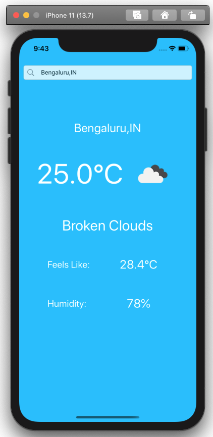
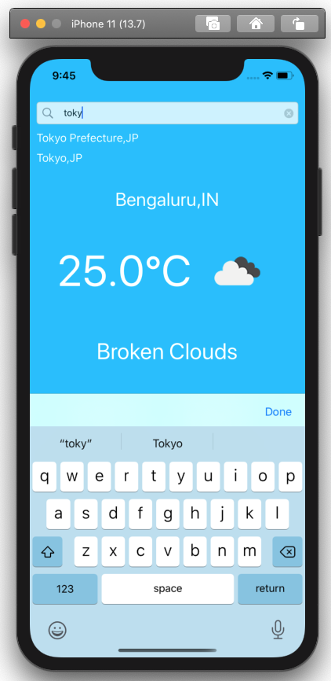
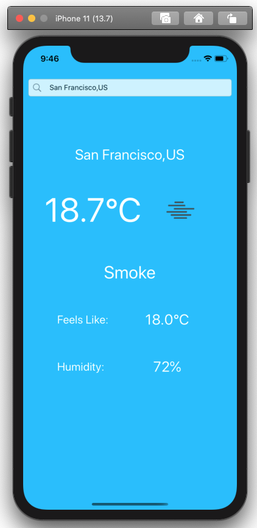

#  World Weather
World Weather is a relatively simple iOS app that allows you to check the current weather for any city in the world.

## How To Use
In the search bar, start to type the city name for which you want to see the weather. As you type, you will get city names below the search bar. Tap the city name you want to see the weather for and it will show on the screen.

## General Info
This project is my first step in learning MVVM design pattern for iOS. In this app I am using the simple approach of __Boxing__ to bind the View to the ViewModel. The goal is to upgrade the app to use RxSwift.

Weather data is pulled from free Web APIs from [openweathermap.org](http://openweathermap.org). To use the app, you would have to create an account with openweathermap.org and get the API key. Set the API key as an environment variable with name __OpenWeatherApiKey__

From openweathermap.org, a JSON file is also available which has names of all the cities for which the weather data is available from their API. This app uses that JSON to provide the cities names.

One of the main advantages of MVVM is improved testability. I would be adding Xcode unit tests shortly.

## Screenshots
Weather|City name suggestions|Weather
---|---|---
||
